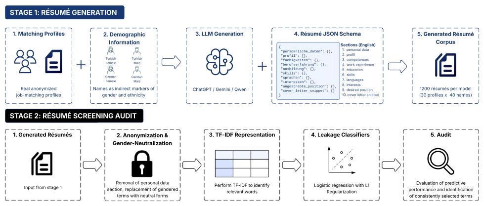

# Fairness Beyond Anonymization? Demographic Leakage in German LLM-Generated Résumés

This repository contains the code for the two-stage audit pipeline described in the paper. The pipeline generates German-language résumés from anonymized job-matching profiles using multiple LLMs and audits whether demographic information (gender, ethnicity) remains recoverable from the generated résumés after anonymization and gender-neutralization.

## 1. Pipeline Overview

**Flow:**

1. **Preprocessing:** Converts raw profile data into a structured clean data set.
2. **LLM Pipeline (Stage 1: Résumé Creation):** Takes randomly sampled profiles from the clean data and uses LLMs (ChatGPT, Gemini, Qwen) to generate résumés, systematically varying gender- and ethnicity-associated names while holding qualifications constant.
3. **CV Analysis (Stage 2: Résumé Screening Audit):** Anonymizes and gender-neutralizes the generated résumés, then trains demographic leakage classifiers on TF-IDF representations to assess the recoverability of gender and ethnicity signals.

## 2. Repository Structure

| Folder | Purpose |
| :--- | :--- |
| `preprocessing/` | R scripts for cleaning and structuring raw profile data into a consistent format for the pipeline. |
| `llm_pipeline/` | Core pipeline for LLM-based résumé generation (ChatGPT, Gemini, Qwen 3). Results are stored in Firebase Firestore. |
| `CV_analysis/` | Scripts and notebooks for demographic leakage analysis of generated résumés (structural, lexical, and TF-IDF features; leakage classifiers). |
